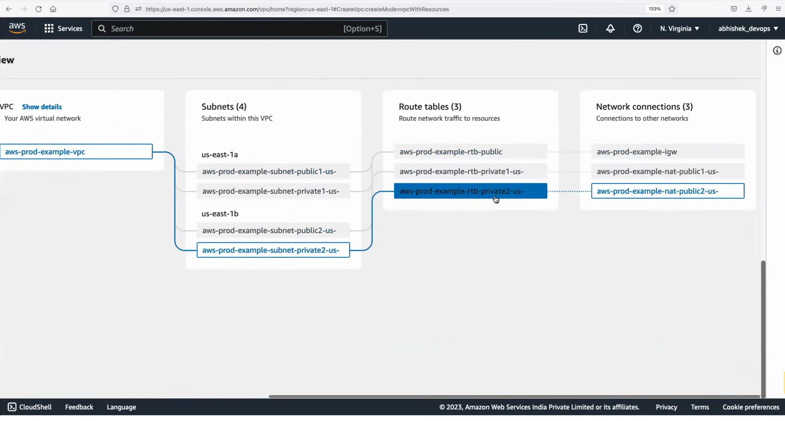
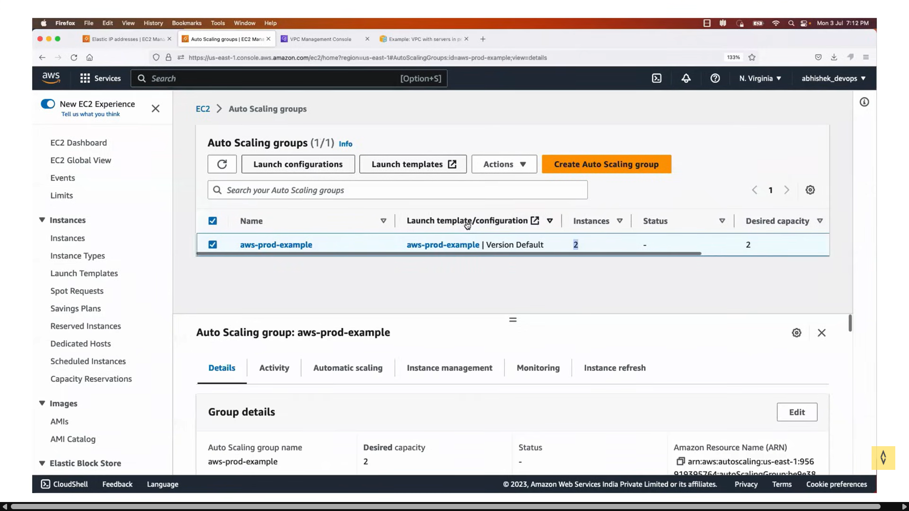
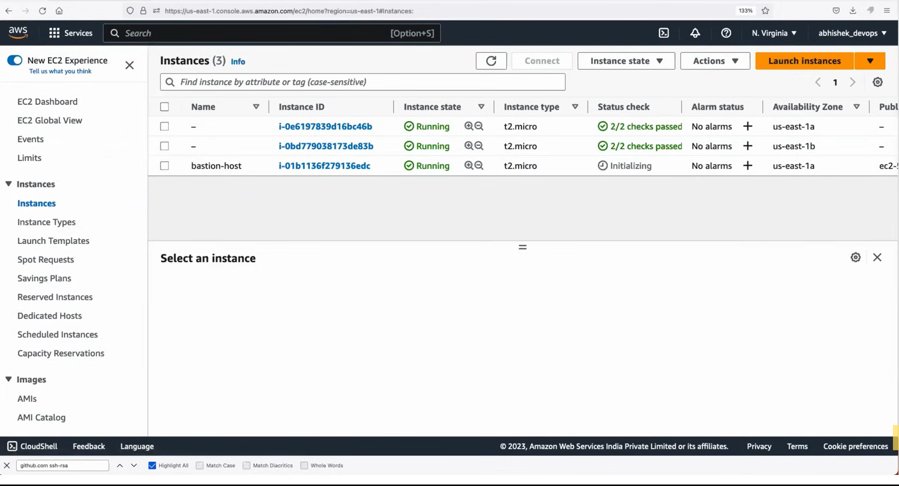
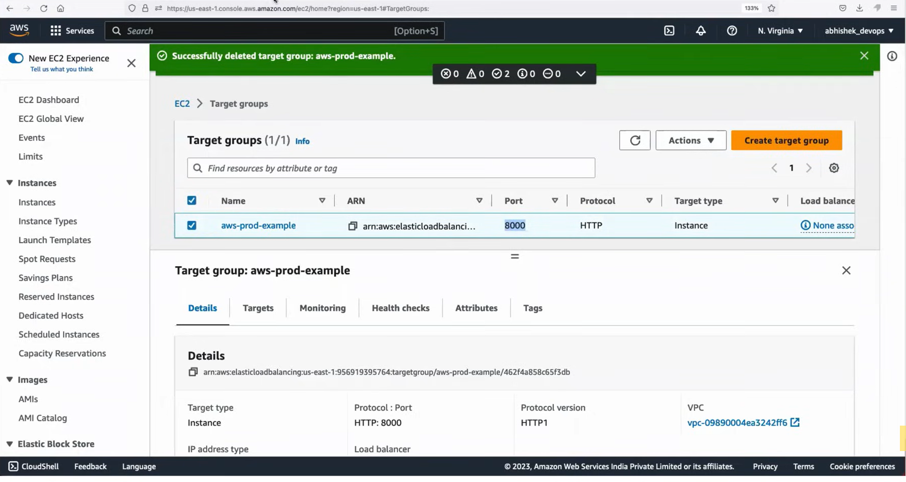
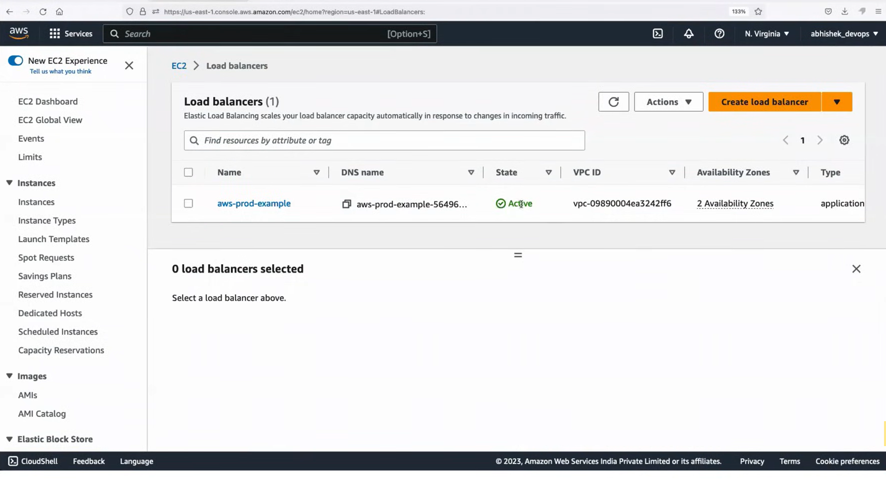
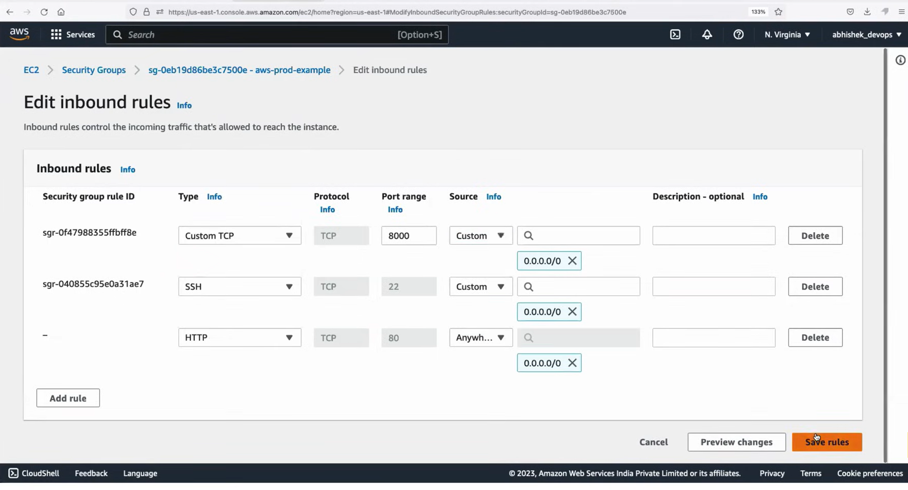
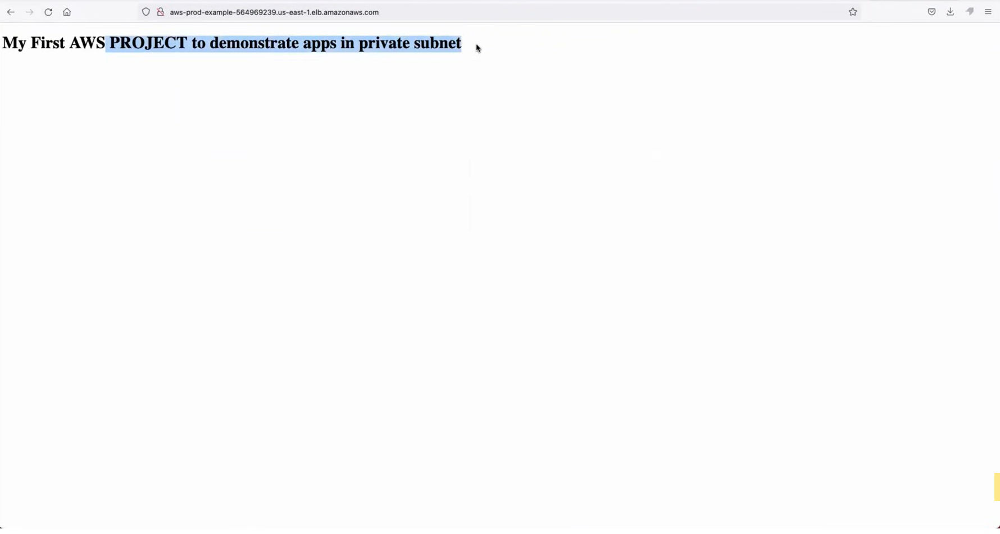
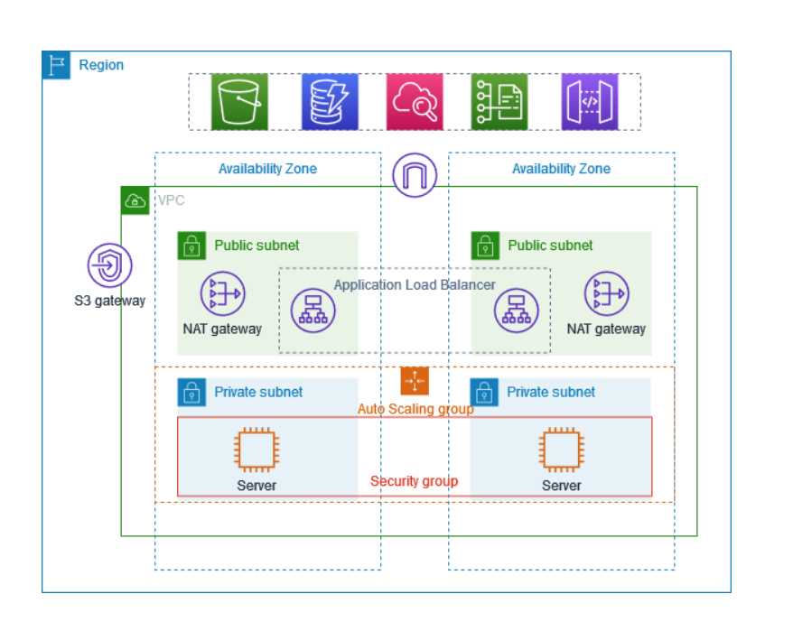

# AWS Production VPC Architecture (Hands-On Example)

This project demonstrates a real-world **AWS Production-grade VPC** setup using multiple AWS components to simulate a scalable and secure infrastructure. The architecture includes:

- A VPC with public and private subnets
- EC2 instances in private subnets (using Auto Scaling)
- A Bastion Host in a public subnet to access private EC2s
- An Application Load Balancer (ALB) routing to private instances
- Target groups, security groups, route tables, and more

---

## 🗺️ Architecture Overview

### VPC Design

- Created a custom VPC with **2 Public Subnets** and **2 Private Subnets**
- Configured **Route Tables**, **Internet Gateway**, and **NAT Gateway**
- Private subnets are in `us-east-1a` and `us-east-1b`

---

### Auto Scaling Group and EC2 Instances

- Auto Scaling group created to launch **2 EC2 Instances** (1 in each private subnet)
- Each private EC2 runs a basic `index.html` file

---

### Bastion Host

- A **Bastion Host** (Jump Box) is deployed in a public subnet
- Used to SSH into private instances securely

---

### Load Balancer Configuration

- Created a **Target Group** for the private EC2 instances
- Setup an **Application Load Balancer (ALB)**
- Security Group for ALB allows **inbound traffic on port 8000**

---

### Security Groups and Networking

- Bastion SG: Allows SSH from My IP
- Private EC2 SG: Allows HTTP from ALB SG
- ALB SG: Allows port 8000 from public
- All routing and NAT Gateway configured properly

---

### Final Architecture Diagram

This diagram summarizes the architecture including all key AWS resources involved.

---

## 🧪 Testing the Setup

1. Access the Bastion Host via SSH.
2. Use the Bastion to SSH into private EC2s.
3. Load balancer can be accessed publicly on **port 8000**.
4. Load balancing between EC2s is visible on refresh.

---

## 📌 Technologies Used

- AWS VPC, Subnets, Route Tables
- EC2 Instances & Auto Scaling Group
- Application Load Balancer (ALB)
- Security Groups & IAM Roles
- Bastion Host for secure access
- Target Groups and Health Checks

---

## 📁 Project Structure

